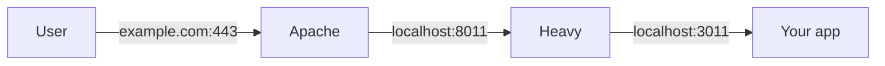

# Heavy

Heavy is a reverse proxy that protects web servers from being knocked over by impolite scrapers.

You deploy Heavy in front of your usual web server, such as Apache. At first, all HTTP traffic flows
through like normal. But when a scraper starts putting too much load on your web server, Heavy
detects the increase in latency and temporarily starts challenging clients by sending them a
proof-of-work JavaScript. This is a short delay for most legitimate users, and a complete block for
most scrapers.

When the impolite scraper gives up and goes away, Heavy starts transparently proxying traffic again.
This means that most of the time, Heavy is invisible. Visitors to your site are only inconvenienced
if they happen to arrive just after a misbehaving bot did.

## Why another tool?

There are existing anti-bot firewalls such as [Anubis](https://anubis.techaro.lol/) or
[go-away](https://git.gammaspectra.live/git/go-away), and Heavy fills a similar role. The main
difference from those is that Heavy biases towards being more permissive:

- Heavy should challenge as few legitimate users as possible.
- Heavy should allow any client to connect, even bots, so long as they don't overwhelm the server.

I don't want to be in the business of micromanaging whitelists of which clients are worthy and which
ones aren't. I just want setting up a small web service to be as simple as it was back in 2019.

There might be circumstances where you specifically want _anti-bot_ behavior, and in those cases,
Heavy might not be the correct tool. For example, maybe you're running a small wiki, and you want to
block _all_ automated clients as part of an anti-spam strategy. That's not what Heavy is designed to
do, and for small wikis, I personally prefer
[less](https://www.mediawiki.org/wiki/Extension:QuestyCaptcha)
[extreme](https://www.mediawiki.org/wiki/Extension:AbuseFilter) measures. But that said, Anubis is a
great tool, and it could be a perfect fit for your goals!

Additionally, _none of these tools are a substitute for security_. Heavy can shield your web server
from run-of-the-mill scrapers that are merely being inconsiderate, but a dedicated attacker can
bypass Heavy, or Anubis, or even paid CAPTCHA tools. You are still responsible for keeping your
software patched!

## How to use it

Heavy is still young software. If you want to deploy it, please drop me a line: I would love to hear
about your use case and help you get set up. Feel free to shoot me an email!

### Architecture

Heavy requires something else to decrypt HTTPS traffic. Assuming you're already using some web
server (Apache, Caddy, etc.) to terminate TLS, your desired architecture will probably look
something like this:

1. User connects to `example.com:443`.
2. Apache listens on 443, decrypts HTTPS, and forwards plain HTTP to `localhost:8011`.
3. Heavy listens on 8011 and forwards legitimate traffic to `localhost:3011`.
4. Your app listens on 3011.



Depending on your application, boxes 2 and 4 might use the same server software. For example, in my
case I'm running MediaWiki on Apache, and I have a single Apache site config with two different
virtual hosts:

- `<VirtualHost *:443>` is public and uses `mod_proxy` to forward traffic to Heavy.
- Heavy forwards it to `<VirtualHost 127.0.0.1:3011>`, which is where I'm running MediaWiki.

### Installation

There are no public builds yet, so you'll first have to build the binary. The simplest way is to run
Cargo on the same kind of machine as your server:

```sh
cargo build --release
```

If your computer has a different OS or processor than your server does, you might need to run the
build on your server, or run the build on your computer but with cross-compilation.

Once you have a binary, copy it to somewhere on your server, such as `/opt/bin/heavy`. Then you'll
need to configure it. By default, Heavy looks for a configuration file at `/etc/heavy/config.toml`.
Here's what mine looks like:

```toml
# /etc/heavy/config.toml
# You can override the default config location by setting the `HEAVY_CONFIG` environment variable.

# Heavy listens on this port:
bind = "0.0.0.0:8011"

# Your app listens here:
target = "http://127.0.0.1:3011"

# In order to secure the proof-of-work calculations, you need to specify a secret string.
# Anything hard to guess will do; I suggest using the output of `openssl rand -hex 16`.
token_secret = "(your secret here)"
difficulty = 20

# Heavy only challenges requests during periods of high load.
# These latency thresholds (in seconds) determine when Heavy becomes strict or relaxed.
[circuit_breaker]
trip_above = 1.0
reset_below = 0.5

# Optional whitelists if you want to make sure certain bots always get through.
# If you want these, check this repo's whitelists/ folder for a script that generates them.
# Then, copy the generated files to /etc/heavy/whitelists/ on your server.
[whitelist]
includes = [
    # Paths are relative to the config file's folder:
    "whitelists/base.toml",
    "whitelists/crawlers.toml",
]
```

For a quick smoke test, run `/opt/bin/heavy` from one terminal and `curl http://127.0.0.1:8011` from
another. If your application is already running on port 3011, Heavy should proxy your request
through, and you should see a response from your application.

Next, let's kill the smoke test, because what we really want is for the system to keep Heavy
running, and to start it every time the server boots. On most Linux distros, you can create
a systemd unit like the following:

```ini
# /etc/systemd/system/heavy.service
[Unit]
Description=Heavy reverse proxy
After=network.target

[Service]
Type=simple
User=ubuntu
ExecStart=/opt/bin/heavy
Restart=on-failure

[Install]
WantedBy=multi-user.target
```

Then you can run:

```sh
sudo systemctl daemon-reload
sudo systemctl enable --now heavy
```

Once that's running and you can see that it's healthy via `systemctl status heavy.service` and/or
`journalctl -fu heavy`, you should be good to configure your web server to start forwarding traffic
from the outside world to localhost:8011.
